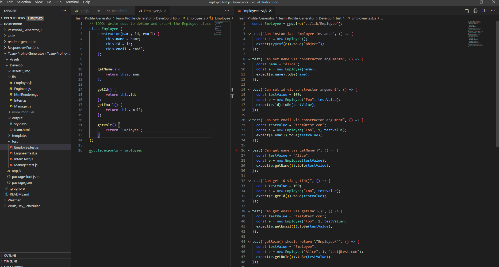
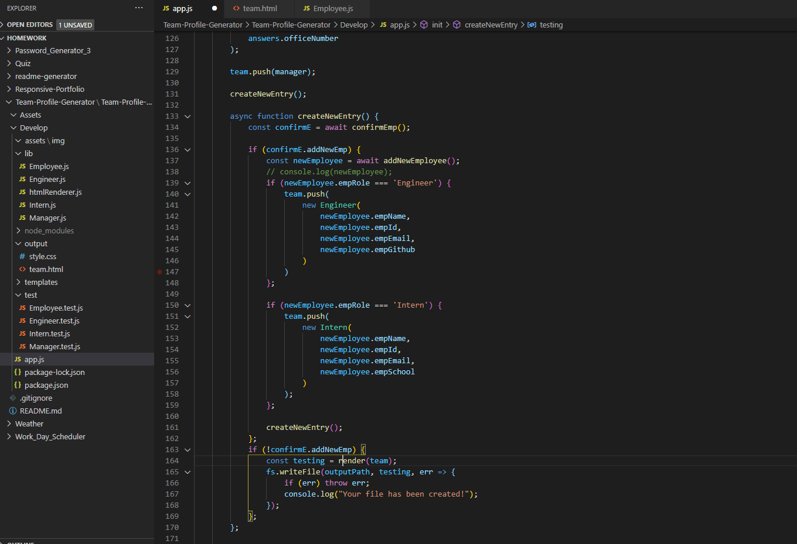
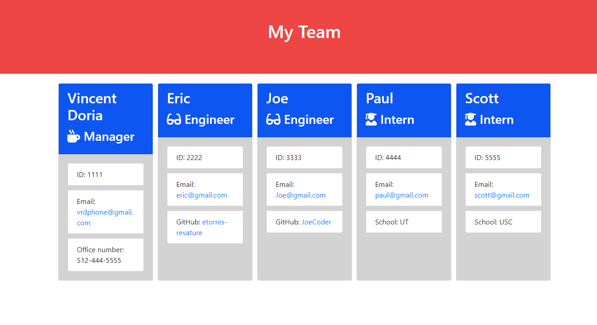

  

   # 📋 Team Profile Generator 📋

  ## Description

  This project generates a Employee profile based on the inputs that are selected.  There are 3 employee roles which are manager, engineer and intern.  Depending on which role you select, the are different prompts to enter.  The user can add as many employees as they choose and when they are finished and do not want to enter any more team members, this program will automatically generate a well rounded html file.

  ## Creator

  Vincent Doria Jr.  
  <a href='https://github.com/Cenzo-cmd' target='_blank'> Github Page</a> 
  <a href="vrdphone@gmail.com">You can email me here</a>

  
  ## Table of Contents

    -[Title](#Team Profile Generator)
    -[Description](#description)
    -[Creator](#creator)
    -[Table of Contents](#table-of-contents)
    -[Installation](#installation)
    -[Test Instructions](#test-instructions)
    -[License](#license)
    
    
  
 

  ## Installation Instructions

  Simply clone this repo to your local machine.  Open this code in VS code or similar and run 'node app.js' .  In order for this program to run, node.js must be installed.

  ## Test instructions

  App is tested and 100% functional.  If there are any problems, please create a ticket.

  ## License
   
  MIT License

  
